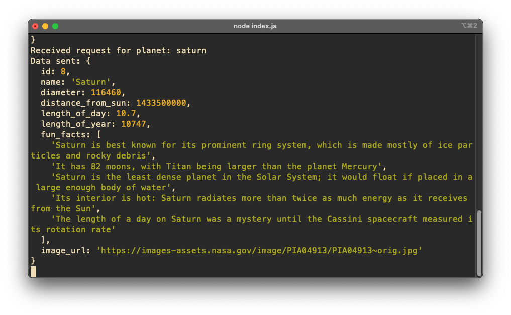

# Solar System Visualization

## Description
This project presents a 3D visualization of the solar system using Three.js, allowing users to explore the various celestial bodies from the comfort of their browser. Users can click on different buttons associated with different celestial bodies to view detailed information on the server terminal, and control the camera to get different views of the solar system.

## Features
- **3D Visualization**: Detailed 3D models of planets and their orbits.
- **Interactive Controls**: Users can manipulate the camera to explore the solar system from different angles.
- **Planet Details**: Click on any celestial body's button to get detailed information on the server terminal such as its diameter, distance from the sun, and interesting facts.

<div style="display:flex">
    
    
</div>

## Technologies Used
- **Three.js**: For 3D visualization
- **React**: UI library used for handling the frontend
- **Node.js and Express**: Backend server to serve the planet data
- **MySQL**: Database to store information about the planets

## Installation
To get this project running on your local machine, follow these steps:

1. **Clone the Repository**
   ```bash
   git clone https://github.com/zainkarim/solar-system-model.git
   cd solar-system-model
   ```

2. **Install Dependencies**
   ```bash
   npm install
   ```

3. **Database Setup**
   - Make sure MySQL is installed on your system.
   - Create a database named `solar_system` and import the provided SQL script to set up your tables:
     ```sql
     CREATE DATABASE solar_system;
     USE solar_system;
     SOURCE solar_system.session.sql;
     ```

4. **Environment Variables**
   - Set up your `.env` file in the server directory with the following contents:
     ```
     DB_HOST=localhost
     DB_USER=your_mysql_username
     DB_PASS=your_mysql_password
     DB_NAME=solar_system
     PORT=5001
     ```

5. **Start the Server**
   ```bash
   npm start
   ```

6. **Run the Client**
   - Open a new terminal in the client directory:
     ```bash
     npm start
     ```

## Usage
Once the installation is complete and both the server and client are running:
- Open your browser to `http://localhost:3000`.
- Use the mouse to rotate and zoom the camera.
- Click on any celestial body's to display detailed information about it in the development terminal.

## License
Distributed under the MIT License. See `LICENSE` for more information.

Project Link: [https://github.com/zainkarim/solar-system-model](https://github.com/zainkarim/solar-system-model)
